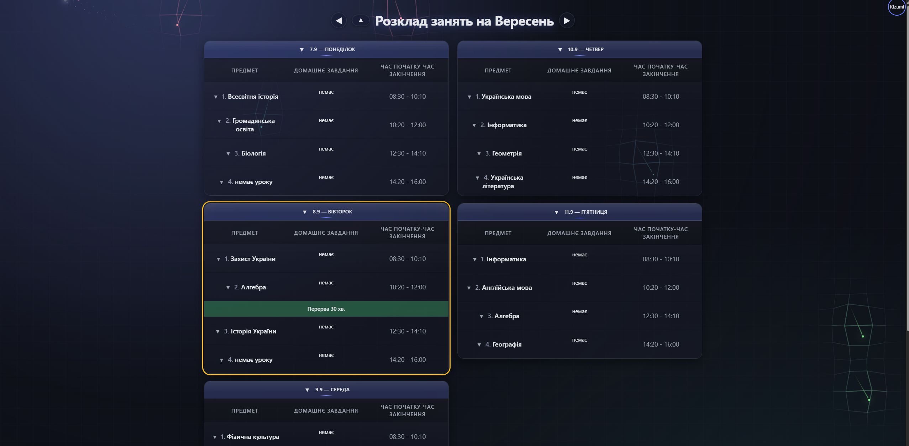

# School Table — Class Schedule with Homework Tracking

**School Table** is a Progressive Web App (PWA) for viewing a school/university class schedule, with support for adding homework notes and classroom numbers. It's built with plain HTML/CSS/JavaScript (no frameworks), backed by Supabase and a separate Node.js authentication service.

## ✨ Features

- 📅 **Weekly schedule** — classes displayed by day (Mon–Fri) in a two-column layout, with week navigation (forward/backward).
- ⏰ **Live highlighting of the current class** and a countdown timer to the end of the class/day, updated every second.
- 📝 **Homework and classroom numbers** — editable directly in each subject card, auto-saved to Supabase.
- ➕ **Add/update schedule** via a simple text format (`date="..."; monday="3,3,11,11"; ...`) with input validation and a built-in info hint (`i`).
- 🔐 **Sign in / Sign up** through a dedicated authentication backend, with a token stored in `localStorage` and protected pages (`checkAuthorizate.js`).
- 👤 **User profile** — dropdown menu with nickname and logout.
- 🎨 Dark ("night") theme with custom UI effects (`Effect.js`).
- 📱 **PWA support**: manifest, icon, "Add to Home Screen", resource caching.

## 🖼️ Screenshots

| Sign In / Sign Up | Class Schedule |
|---|---|
|  |  |

## 🏗️ Tech Stack

| Layer | Technology |
|---|---|
| Frontend | HTML5, CSS3, Vanilla JavaScript |
| Database / schedule storage | [Supabase](https://supabase.com) |
| Authentication | Separate Node.js backend, deployed on [Railway](https://railway.app) |
| Hosting | Netlify (`_headers` and `_redirects` used for caching rules and API proxying) |

## 📂 Project Structure

```
schooltable/
├── index.html              # main schedule page
├── autorizate.html          # sign in / sign up page
├── manifest.json             # PWA manifest
├── _headers / _redirects     # Netlify caching and API proxy config
├── assets/
│   └── icon.jpg
├── Styles/
│   ├── tables.css
│   └── Autorizate.css
└── Js/
    ├── tablesJs/
    │   ├── config.js           # Supabase & API configuration
    │   ├── table.js             # schedule rendering and logic
    │   ├── addtable.js          # parsing and adding a new schedule
    │   ├── checkAuthorizate.js  # authentication check
    │   ├── profile.js           # profile menu / logout
    │   └── timer.js             # countdown timer to end of class/day
    ├── Autorizate/
    │   └── Autorizate.js        # sign in / sign up logic
    └── Effects/
        └── Effect.js            # UI visual effects
```

## 🚀 Running Locally

The project consists of static files only, so any static file server will work:

```bash
npx serve schooltable
# or
python3 -m http.server --directory schooltable
```

Then open `index.html` in your browser. Full functionality requires an active connection to Supabase and the authentication backend (configured in `Js/tablesJs/config.js`).

## ⚠️ Project Status

Alpha version — the project is under active development; the data structure and schedule format may change.

## 📄 License

Add your preferred license here (e.g. MIT).